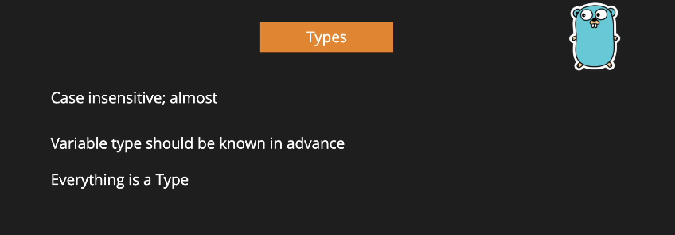
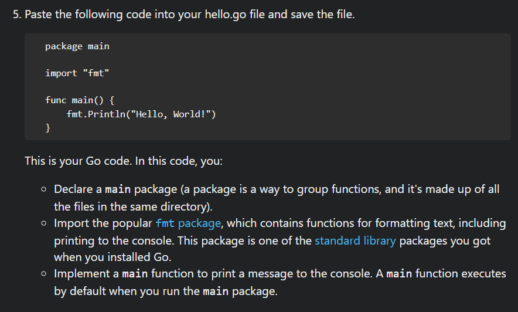
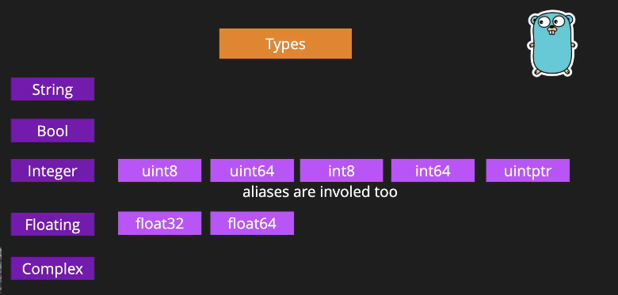
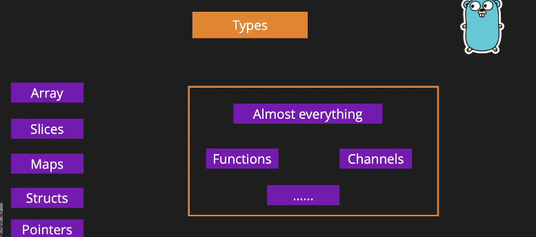

# Lexical comes from lexeme → meaningful units of source code

``` go

package main

import "fmt"

func main(){
    fmt.Println("Hi gomo");
}
```

- GO Documentation : [DOC](https://go.dev/doc/)







